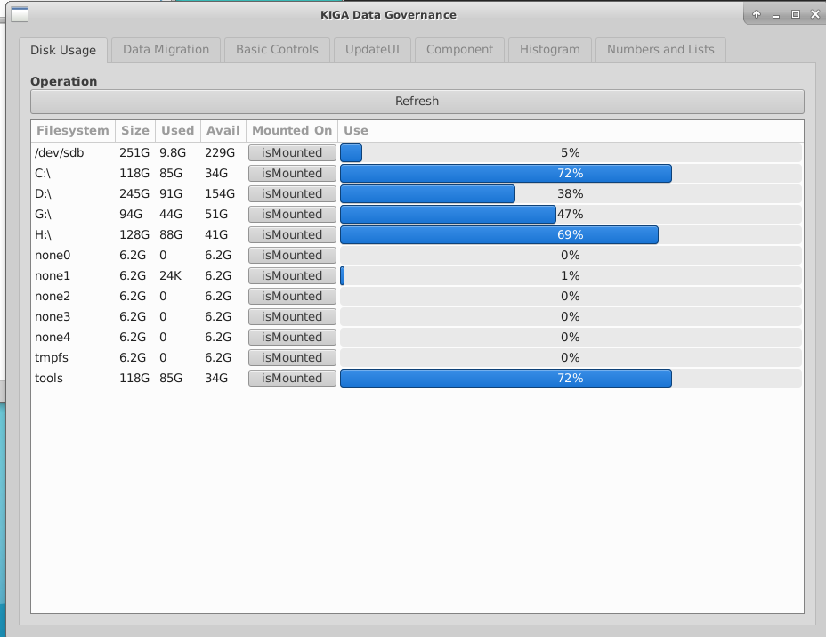
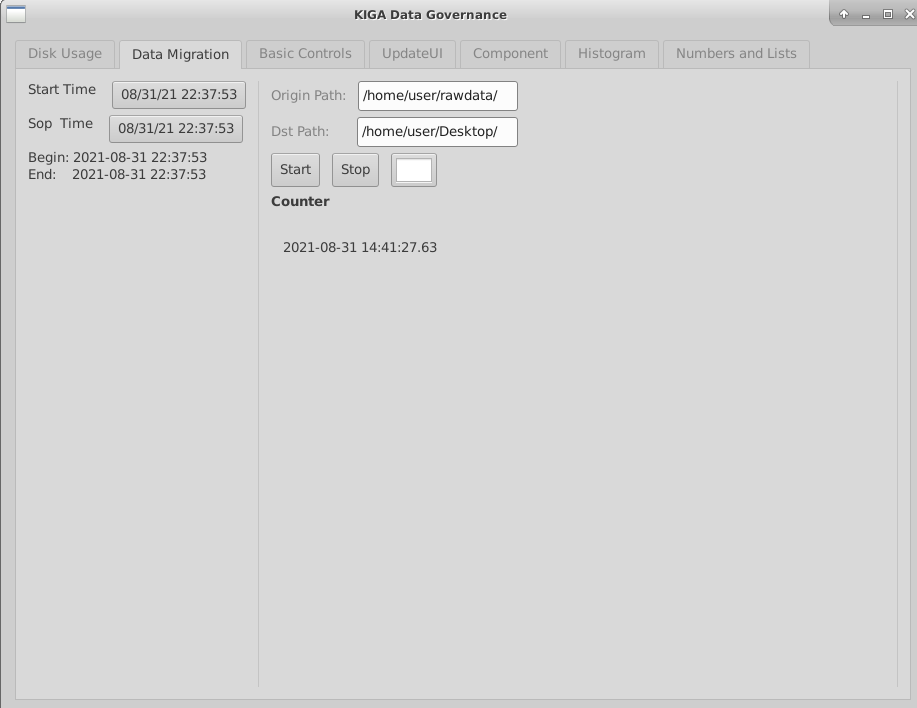

## 基于andlabs/ui组件的可视化Go程序

<mark>andlabs/ui</mark>

>https://github.com/andlabs/ui

- Windows: cgo, Windows Vista SP2 with Platform Update and newer
- Mac OS X: cgo, Mac OS X 10.8 and newer
- other Unixes: cgo, GTK+ 3.10 and newer
    - Debian, Ubuntu, etc.: sudo apt-get install libgtk-3-dev
    - Red Hat/Fedora, etc.: sudo dnf install gtk3-devel

### 基本功能

1. Linux下磁盘挂载、磁盘信息展示
2. 文件夹、文件的拷贝操作，并展示拷贝状态
3. 定时任务操作
4. 组件使用案例
5. 可编辑的柱状图
6. 下拉表单、processbar展示

### 使用感受

ui组件不更新了，功能少的可怜，总之用着比较蛋疼。

不过能实现一些简单的功能，毕竟Go本来不是针对UI做的。

### Case

>磁盘信息
- 显示磁盘分区、大小使用量、挂载状态
- 未挂载的磁盘可通过按钮进行挂载(默认挂载路径为/mydata/data)
- 已挂在的磁盘显示未/mydata/data，再次点击按钮可进行卸载

>数据迁移
- 输入原路径即目标路径，将对应数据拷贝至目标路径下
- 开始进行后，右侧将显示拷贝状态，绿色表示正在进行中，蓝色表示结束，红色表示中断
- 左侧选择生成文件的日期，拷贝该时间段内的所有数据 // 懒得写

>其他 
- 只是例子，界面太糙，组件支持很少，不是很推荐使用该组件，玩玩倒是可以
- 优点是第三方依赖少，基本上都是纯Go写的，代码量极少
- version 1.0.0结束！

